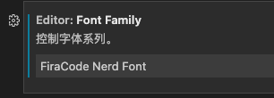

## 1、Windows

### 1.1 Windows开机启动

```shell
# 目录地址
C:\ProgramData\Microsoft\Windows\Start Menu\Programs\StartUp
```

## 2、Mac

### 2.1 手动刷新DNS
```shell
sudo dscacheutil -flushcache
```

### 2.2 Mac开启任何来源的APP

```shell
sudo spctl --master-disable
```
### 2.3 Host key verification failed

```shell
ssh-keygen -R 你要访问的IP地址
#将host key从know_hosts移至know_hosts.old中去
```

### 2.4 安装powerleve10k

```shell
git clone https://github.com/romkatv/powerlevel10k.git $ZSH_CUSTOM/themes/powerlevel10k

vim ~/.zshrc 

#add
ZSH_THEME="powerlevel10k/powerlevel10k"
POWERLEVEL9K_MODE="awesome-patched"
```
### 2.5 tmux常用快捷键

```shell
tmux new -s "name" #创建session
tmux attach -t     #重新连接session
ctrl b %   #横向分屏
ctrl b "   #纵向分屏
ctrl b o   #选择窗格
ctrl d     #关闭
ctrl b d   #隐藏所有session
ctrl b s/w #选择session
```

### 2.6 应用添加快捷键

```javascript
# 以iTerm为例
on run {input, parameters}
     (* Your script goes here *)
     tell application "iTerm"         
          reopen         
          activate        
         end tell
end run
```

### 2.7 Mac下Terminal指定用Sublime打开文件

```shell
#1、open -a
open -a /Applications/Sublime\ Text.app test.txt

#2、软链接
ln /Applications/Sublime\ Text.app/Contents/SharedSupport/bin/subl /usr/local/bin/subl
subl test.txt

#3、alias
alias sublime='open -a /Applications/Sublime\ Text.app'
sublime test.txt
```

### 2.8 `raw.githubusercontent.com`DNS污染问题
- 打开[ipaddress.com](https://www.ipaddress.com)查询`raw.githubusercontent.com`真实ip
```shell
sudo vim /etc/hosts
#最后一行添加
199.232.68.133    raw.githubusercontent.com
sudo dscacheutil -flushcache    #刷新DNS缓存
```

### 2.9 艺术字生成器

```shell
figlet 内容
```

### 2.10 谷歌云ssh

```shell
sudo -i    #超级管理员

vi /etc/ssh/sshd_config    #修改SSH配置文件

PermitRootLogin yes    #默认为no，需要开启root用户访问改为yes
PasswordAuthentication yes    #默认为no，改为yes开启密码登陆

passwd root    #设置密码

/etc/init.d/ssh restart    #重启ssh服务
```

### 2.10 zsh警告信息

```shell
#说明https://www.bootschool.net/article/5e79aba6f60a317efe5bbbd5/oh-my-zsh-warning-message-insecure-completion-dependent-directories-detected
vim ~/.zshrc
chmod 755 /usr/local/share/zsh
chmod 755 /usr/local/share/zsh/site-functions
```

### 2.11 电脑连接Termux

```
#termux:
ssh-keygen  #生成公钥

whoami   #查看用户名

# 然后将id_rsa.pub上传到电脑

#电脑
ssh 用户名@ip -p 8022
```

### 2.12 linux查看修改时区

```
一、查看和修改Linux的时区

1. 查看当前时区

date -R

2. 修改设置Linux服务器时区
方法 A

tzselect

方法 B 仅限于RedHat Linux 和 CentOS

timeconfig"

方法 C 适用于Debian

dpkg-reconfigure tzdata

3. 复制相应的时区文件，替换系统时区文件；或者创建链接文件

cp /usr/share/zoneinfo/$主时区/$次时区 /etc/localtime

例如：在设置中国时区使用亚洲/上海（+8）

cp /usr/share/zoneinfo/Asia/Shanghai /etc/localtime
```

### 2.13 mac文本清除格式

```
#Command+Shift+T就可以变成txt
```

### 2.14 VS Code修改Nerd Font

设置-Font-输入'FiraCode Nerd Font'



## 3、OpenWrt

### 3.1 samba命令

```shell
#重启
/etc/init.d/samba4 restart
#开机启动
/etc/init.d/samba4 enable
#设置密码
smbpasswd -a root ****
```

## 4、其他

### 4.1 sublime text 3激活码

```txt
----- BEGIN LICENSE -----
Member J2TeaM
Single User License
EA7E-1011316
D7DA350E 1B8B0760 972F8B60 F3E64036
B9B4E234 F356F38F 0AD1E3B7 0E9C5FAD
FA0A2ABE 25F65BD8 D51458E5 3923CE80
87428428 79079A01 AA69F319 A1AF29A4
A684C2DC 0B1583D4 19CBD290 217618CD
5653E0A0 BACE3948 BB2EE45E 422D2C87
DD9AF44B 99C49590 D2DBDEE1 75860FD2
8C8BB2AD B2ECE5A4 EFC08AF2 25A9B864
------ END LICENSE ------​
```
### 4.2 解除浏览器复制文本限制

- 控制台-`document.body.innerText`
