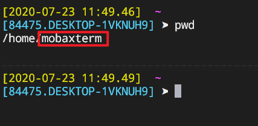
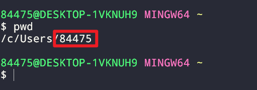

## 说明

在使用cmd或者git bash生成ssh公钥之后，在服务器上加入对应的公钥即可免密进行ssh连接，但是在MobaXterm中新建连接还是需要输入密码。

```shell
Access denied
root@192.168.11.61's password:
```

## 原因

这是因为MobaXterm命令行登录的用户是mobaxterm，而并非是我们登陆系统的用户。

- user for mobaxterm



- user for windows



## 解决

只需要在MobaXterm的会话设置中要选中SSH所用的私钥文件即可。


