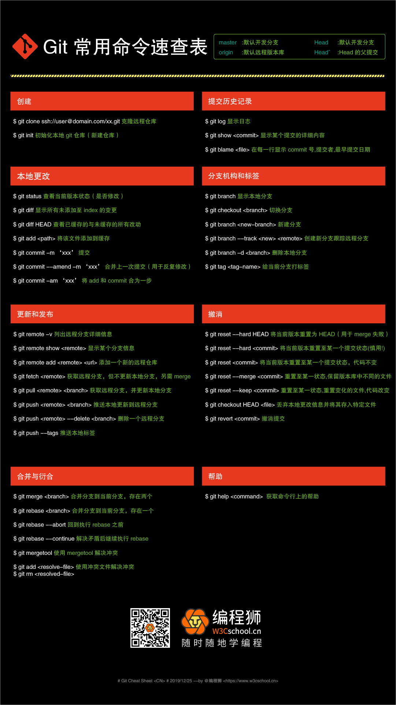

## 前言

git仓库使用的基本操作，以及生成使用ssh公钥

## git初始化

```shell
git config --global user.email "youremail@domain.com"
git config --global user.name "Your Name"

#查看
git config --list
```

## 生成SSH公钥

- SSH 公钥默认储存在账户的主目录下的 ~/.ssh 目录。先确认是否已经有一个公钥了

```shell
#查看是否存在.ssh文件夹ls -la  ~/
cd ~/.ssh
```

-  创建新的SSH公钥

```shell
cd ~
ssh-keygen -t rsa -C "youremail@domain.com"

#出现以下结果则说明创建成功
Generating public/private rsa key pair.
Enter file in which to save the key (/root/.ssh/id_rsa): # 直接回车，则将密钥按默认路径及文件名进行存储。此时也可以输入特定的文件名
Created directory '/root/.ssh'.
Enter passphrase (empty for no passphrase):  # 根据提示，你需要输入密码和确认密码。可以不填，设置为空值，直接回车
Enter same passphrase again: 
Your identification has been saved in /root/.ssh/id_rsa.
Your public key has been saved in /root/.ssh/id_rsa.pub.
The key fingerprint is:
SHA256:yFt14TcP0H+ixy9VKiILPPJ6DVevkKgrbxVFqk7mn5k xxxxxx@126.com
The key's randomart image is:
+---[RSA 2048]----+
|            o.   |
|      .    . o.  |
|     o    . o +. |
|    .... ... ..++|
|   . o .So .   o+|
|  + o Bo= . + + .|
| =   *.* +   o o |
|  ++o o o .   . .|
|  E=++         . |
+----[SHA256]-----+
```
- 查看生成文件

```shell
cd ~/.ssh
ls
#显示以下内容
id_rsa      id_rsa.pub
```
其中id_rsa.pub就是公钥

- 测试连接

```shell
ssh -T git@github.com
```

## Git命令速查表



