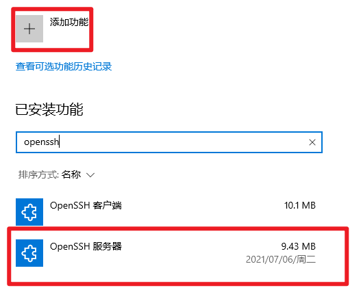
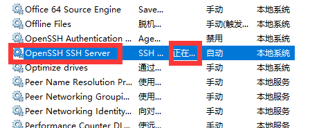

## 安装

- win+r
- 输入`fodhelper`
- 下载`openssh服务端`
- 打开`服务`，开启`openssh server服务`





## 拓展

1. ssh服务端安装好后即可当作SFTP服务器

```
FTP 基于TCP来传输文件，明文传输用户信息和数据。
SFTP 基于SSH来加密传输文件，可靠性高，可断点续传。
SCP 是基于SSH来加密拷贝文件，但要知道详细目录，不可断点续传。
```

> 推荐链接：博客园-[***文件传输协议FTP、SFTP和SCP***](https://www.cnblogs.com/xingxia/p/system_ftp.html)

2. **Mbps (bits per second)**

bit（位，又名“比特”）：bit的缩写是b，是计算机中的最小数据单位（属于二进制的范畴，其实就是0或者1）
Byte（字节）：Byte的缩写是B，是计算机文件大小的基本计算单位。比如一个字符就是1Byte，如果是汉字，则是2Byte。换算
```
  1B（字节）=8b（位）
  1 KB = 1024 B
  1 MB = 1024 KB
  1 GB = 1024 MB
  1TB = 1024GB
```


1Mbps = 1Mb/s = 1*1024Kb/s = 1024/8KB/s = 125KB/s    


100Mbps = 100Mb/s = 100/8MB/s = 12.5MB/s  
即100M宽带理论上最大下载速度12.5MB/s